# 👕 Roperos Minuto de Dios
Aplicación móvil para Android (Kotlin) creada para apoyar los procesos del [Banco de ropa del Minuto de Dios](https://minutodedios.org/programa/banco-de-ropa)

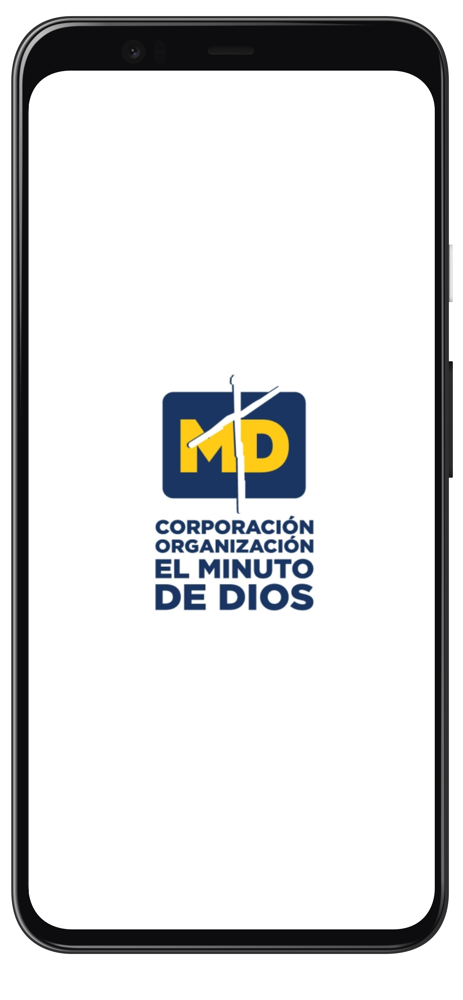

## 📐 Pantallas:
_* Las interfaces de la aplicación han sido creadas utilizando [Jetpack Compose](https://developer.android.com/jetpack/compose?hl=es-419)_

|                                                          |                                                       |                                                 |
| -------------------------------------------------------- | ----------------------------------------------------- | ----------------------------------------------- |
| 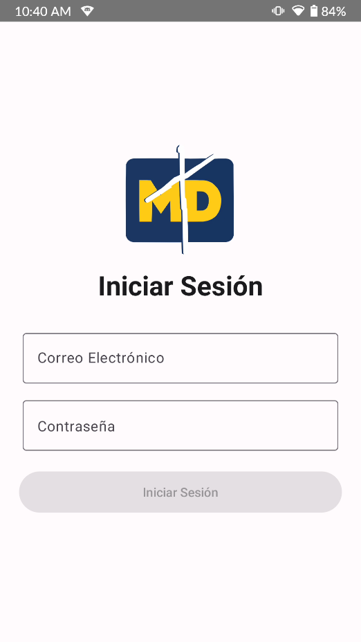           | 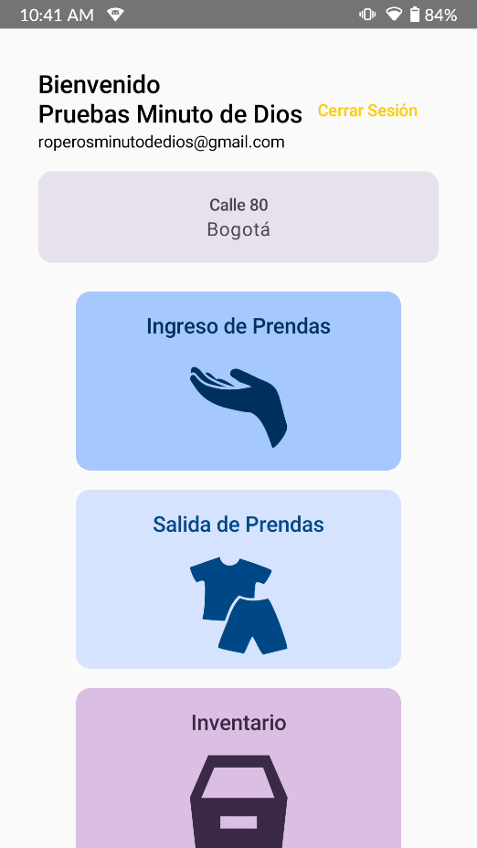              | 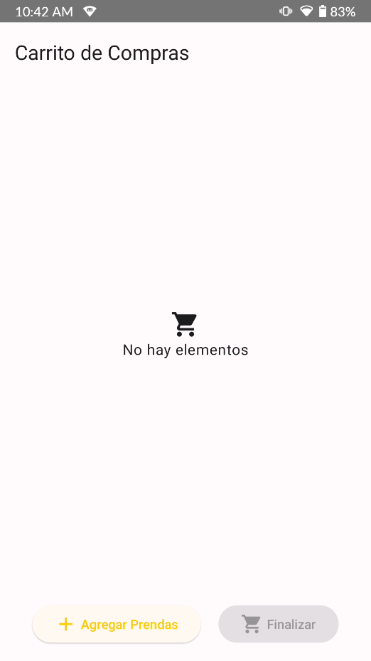    |
| 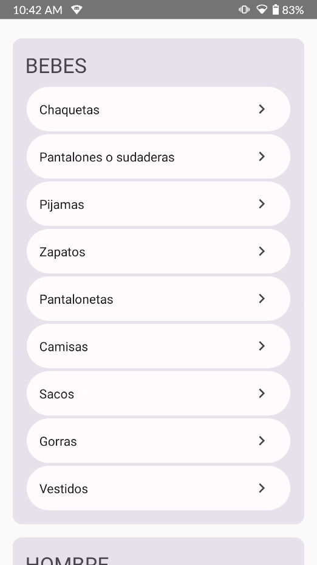       | 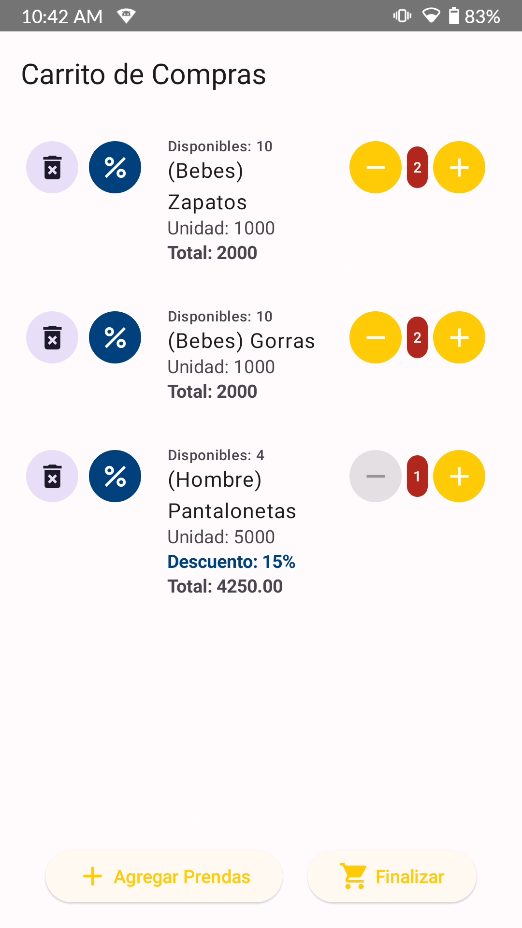   | 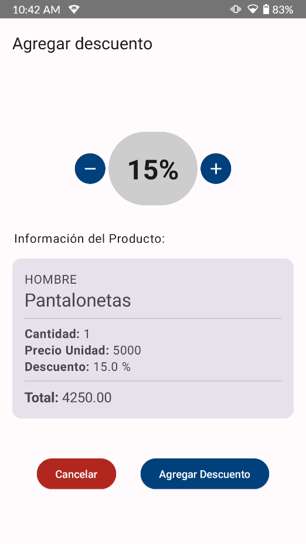 |
| 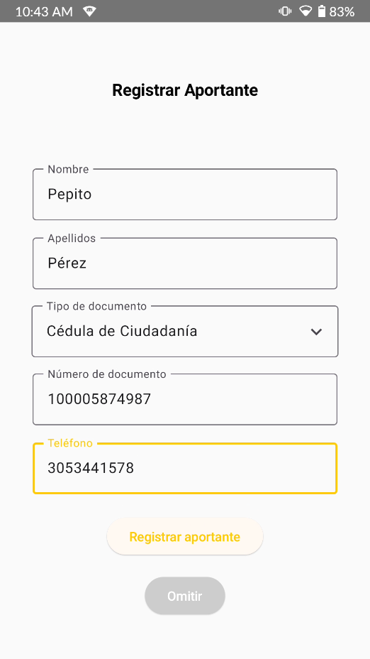 | 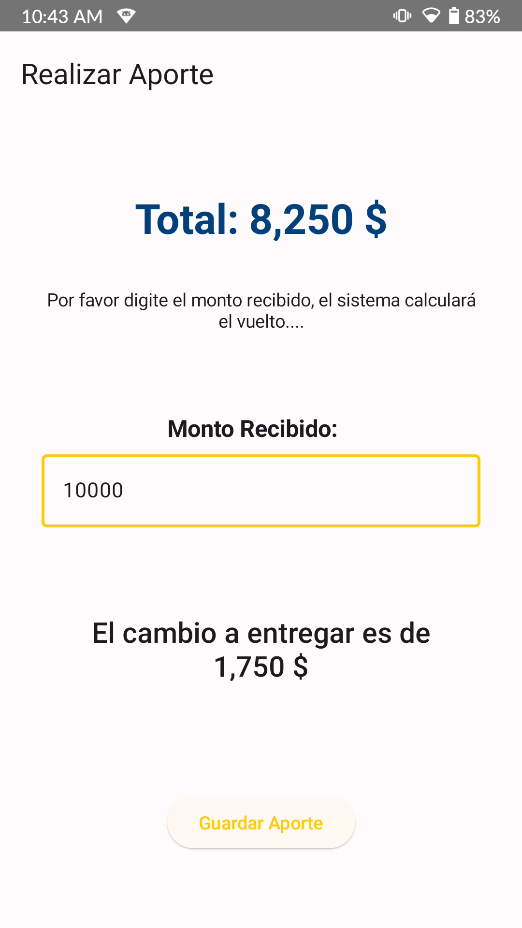     | 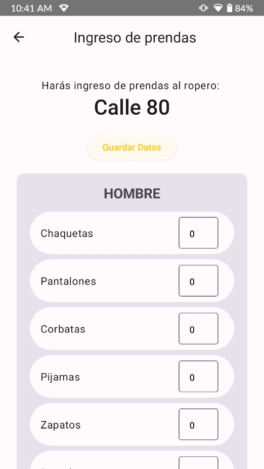              |
| 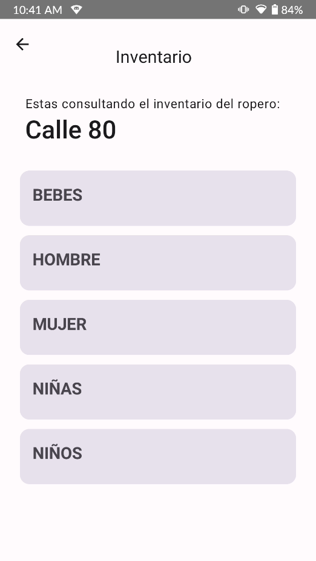            | 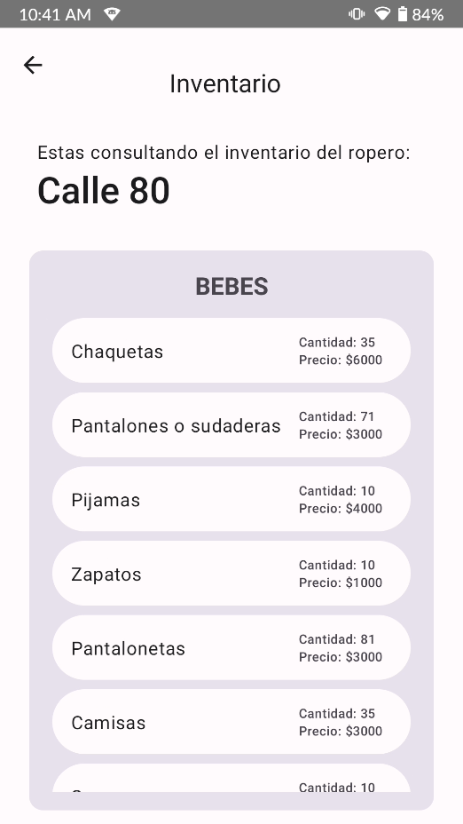 | 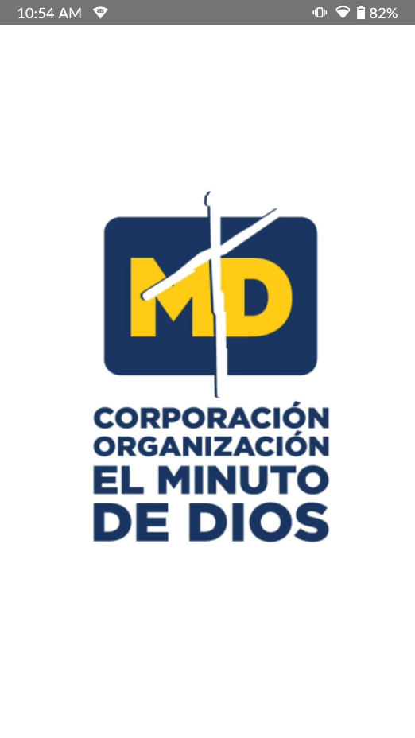           |

## 🤝 Propósito
El presente semestre se realizó la practica social en el Banco de Ropa de la Corporación Minuto de Dios, específicamente en el programa de roperos mencionado anteriormente, la cual iba enfocada principalmente a mejorar el proceso de control de inventarios dentro de los roperos y en la venta de prendas en los roperos para que se redujera el uso de papel y las tareas manuales implicadas dentro del proceso. La directora del Banco de Ropa nos solicitó el desarrollo de una aplicación móvil que fuese sencilla de usar para los administradores de los roperos y que permitiese manejar todos estos procesos manuales en donde se hacía uso de mucho papel.

## 📄 Especificación de Requerimientos de Software (SRS-IEEE 29148)

Los requerimientos de Software han sido especificados en conformidad con el estándar [IEEE 29148](https://standards.ieee.org/ieee/29148/6937/), este documento se encuentra disponible en el directorio _docs_:
[Especificación de Requerimientos de Software v1.0](./docs/SRS_V1.pdf)

## 🔩 Créditos
#### Semestre 2023-01
- Juan E. Urquijo
- Ángel D. Talero
